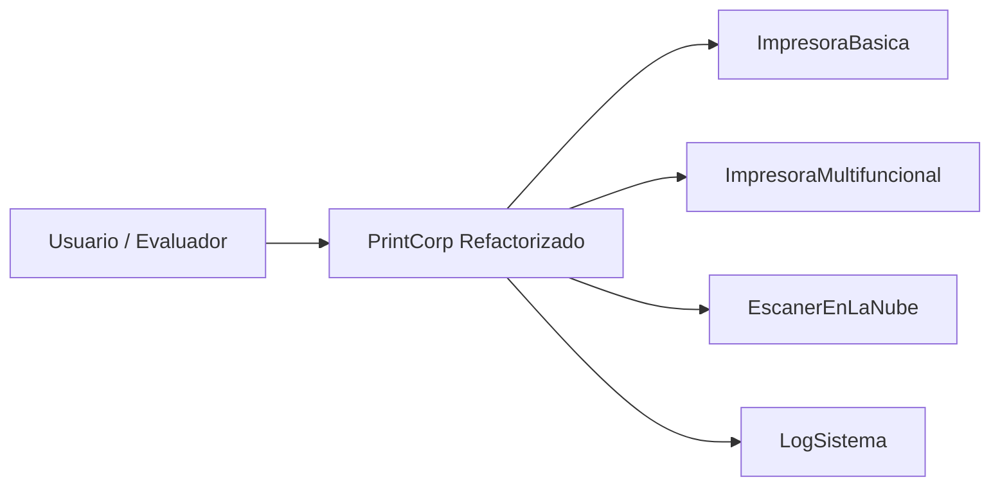
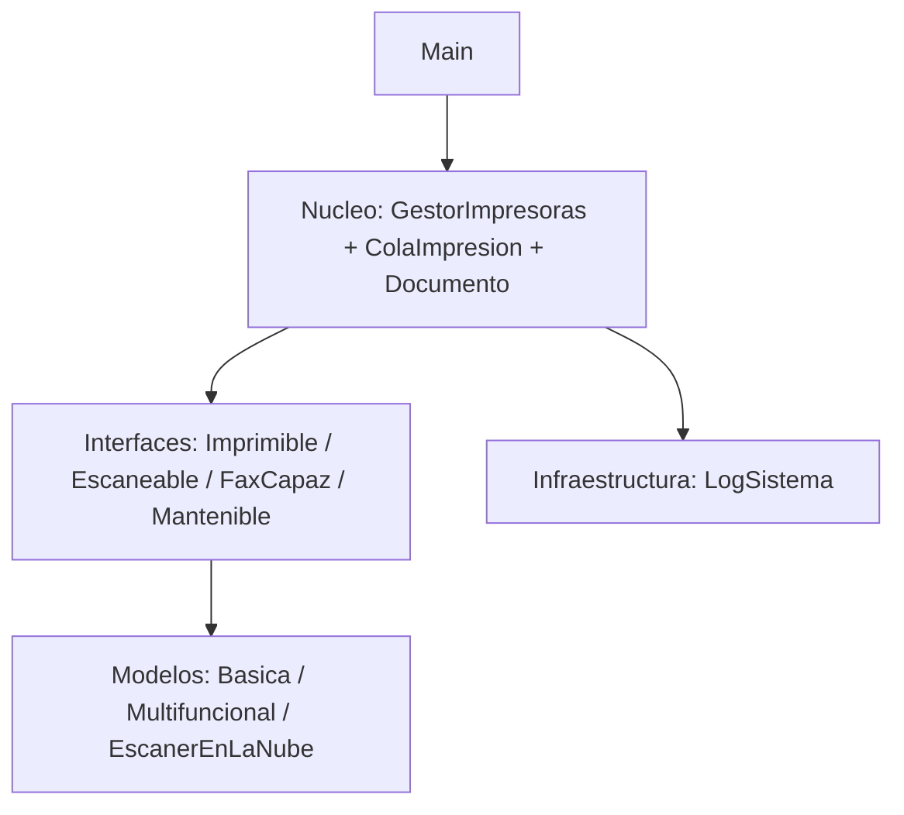
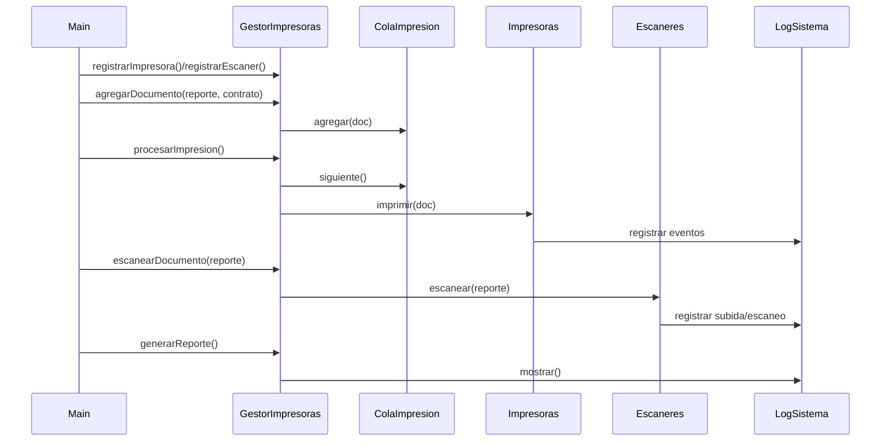
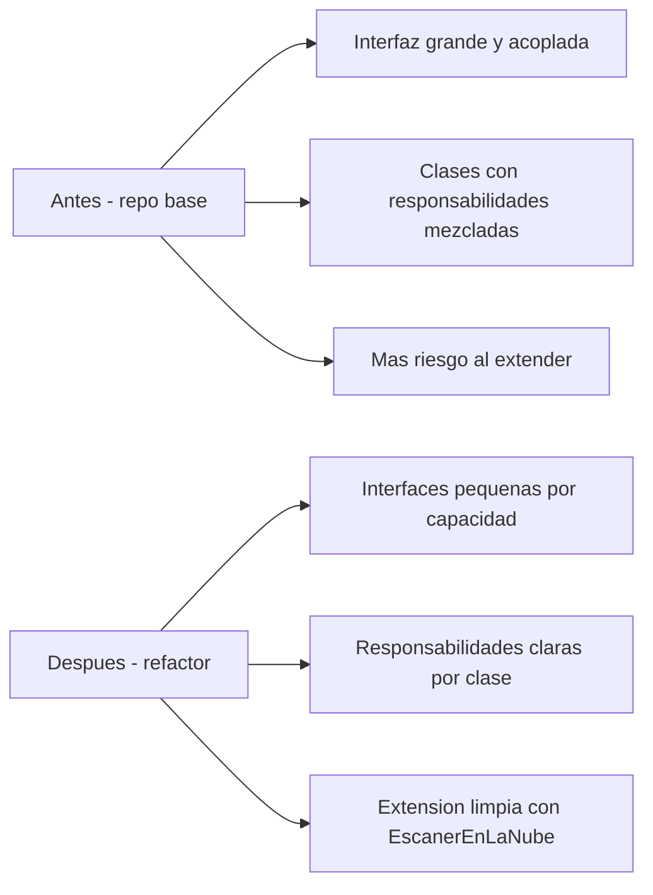

# Sustentacion del reto SOLID - PrintCorp (guia paso a paso)

## Repositorio base evaluado

Este trabajo toma como base el repositorio original del reto:

- `https://github.com/KevinAB06/MiniReto.git`

Lo que presento aqui es la **sustentacion del refactor** aplicado sobre esa base, explicando que se ajusto, por que se ajusto y como quedo funcionando.

---

## 1) Contexto del reto

En el repositorio original habia un sistema que funcionaba, pero con estructura poco mantenible: clases muy cargadas, contratos demasiado grandes y logica mezclada.

Mi objetivo fue **ordenar la arquitectura** para que el sistema fuera:

- mas facil de mantener,
- mas facil de extender,
- y mas claro para cualquier persona que lo lea.

La idea central fue aplicar **SOLID** sin volver el proyecto innecesariamente complejo, manteniendo el alcance del reto.

---

## 2) Ajustes aplicados sobre el repo original

Estos fueron los cambios principales del refactor:

1. Se separaron contratos en interfaces pequenas (`Imprimible`, `Escaneable`, `FaxCapaz`, `Mantenible`).
2. Se elimino la necesidad de implementar metodos que no corresponden a cada dispositivo.
3. Se simplifico la logica interna y se retiro codigo de simulacion sin valor funcional.
4. Se centralizo el registro de eventos en `LogSistema`.
5. Se organizo el flujo de negocio en capas (`interfaces`, `modelos`, `nucleo`, `infraestructura`).
6. Se agrego `EscanerEnLaNube` como extension real del sistema (sin romper codigo existente).

En resumen: no se rehizo el proyecto desde cero, se **refactorizo lo existente** para dejarlo claro, extensible y justificable en una sustentacion.

---

## 3) Que problema habia antes (en palabras simples)

Antes, una sola interfaz obligaba a todas las impresoras a hacer de todo: imprimir, escanear, fax y mantenimiento.

Eso generaba 3 problemas directos:

1. clases implementando metodos que no necesitaban,
2. riesgo de errores por metodos no soportados,
3. codigo dificil de ampliar sin tocar lo existente.

---

## 4) Que arquitectura aplique

Use una arquitectura por capas simples:

- **interfaces**: contratos pequenos (que puede hacer cada dispositivo),
- **modelos**: implementaciones reales (impresoras y escaner en nube),
- **nucleo**: orquestacion del flujo (cola, gestor, documento),
- **infraestructura**: logging del sistema.

Con esto logro separacion de responsabilidades y bajo acoplamiento.

---

## 5) Como funciona el sistema (paso a paso)

### Paso 1 - Arranque del sistema
En `Main.java` se crea un `GestorImpresoras` y se crean dispositivos:

- una `ImpresoraMultifuncional` (HP),
- una `ImpresoraBasica` (Canon),
- un `EscanerEnLaNube` (bucket en S3).

### Paso 2 - Registro de capacidades
El gestor registra:

- impresoras en una lista de `Imprimible`,
- escaneres en una lista de `Escaneable`.

Esto aplica DIP: el gestor depende de contratos, no de clases concretas.

### Paso 3 - Entrada de documentos
Se crean 2 documentos (`Reporte Q1` y `Contrato NDA`) y se agregan a `ColaImpresion`.

### Paso 4 - Proceso de impresion
`GestorImpresoras.procesarImpresion()` saca cada documento de la cola y lo envia a todas las impresoras registradas.

### Paso 5 - Escaneo puntual
`GestorImpresoras.escanearDocumento(reporte)` manda el documento a todos los escaneres registrados.

### Paso 6 - Fax
Solo la multifuncional envia fax (`hp.enviarFax(...)`), porque es la unica que implementa `FaxCapaz`.

### Paso 7 - Reporte final
`gestor.generarReporte()` muestra conteos del sistema y luego imprime el log central.

---

## 6) Explicacion de cada archivo (uno por uno)

> Nota: estos archivos representan la version refactorizada que construimos a partir del repo base del reto.

## Capa `interfaces`

### `Imprimible.java`
Contrato minimo para imprimir.

### `Escaneable.java`
Contrato minimo para escanear.

### `FaxCapaz.java`
Contrato minimo para envio de fax.

### `Mantenible.java`
Contrato para operaciones de mantenimiento fisico del equipo.

> Valor arquitectonico: aplica ISP (interfaces pequenas y enfocadas).

---

## Capa `nucleo`

### `Documento.java`
Entidad de dominio. Solo guarda datos del documento y una regla simple de peso de impresion.

### `ColaImpresion.java`
Cola FIFO de documentos. Se encarga solo del orden de procesamiento.

### `GestorImpresoras.java`
Orquestador principal:

- registra dispositivos,
- agrega documentos a cola,
- procesa impresion,
- coordina escaneo,
- genera reporte.

> Valor arquitectonico: SRP en cada clase y DIP en el gestor.

---

## Capa `modelos`

### `ImpresoraBasica.java`
Implementa `Imprimible` y `Mantenible`. No tiene fax ni escaner porque no le corresponde.

### `ImpresoraMultifuncional.java`
Implementa `Imprimible`, `Escaneable`, `FaxCapaz` y `Mantenible`.

Incluye:

- control de tinta,
- impresion por paginas,
- escaneo,
- envio de fax con validacion simple,
- registro en log.

### `EscanerEnLaNube.java`
Implementa solo `Escaneable` y simula subida a nube.

> Valor arquitectonico: OCP (se agrego como extension sin modificar el gestor ni contratos existentes).

---

## Capa `infraestructura`

### `LogSistema.java`
Servicio estatico de logging:

- registra eventos con fecha y hora,
- muestra el historial,
- recorta logs si crecen demasiado.

> Valor arquitectonico: separa preocupaciones tecnicas del dominio (SRP).

---

## 7) Donde se ve SOLID en este proyecto

- **S (SRP)**: cada clase tiene una responsabilidad clara.
- **O (OCP)**: `EscanerEnLaNube` se integra sin romper lo existente.
- **L (LSP)**: no hay metodos no soportados escondidos; cada implementacion cumple su contrato.
- **I (ISP)**: contratos separados por capacidad real.
- **D (DIP)**: el gestor depende de interfaces (`Imprimible`, `Escaneable`).

---

## 8) Resultado de ejecucion (resumen)

La salida valida que todo el flujo funciona correctamente:

- registro de impresoras y escaneres,
- documentos encolados,
- impresion completa en ambos dispositivos,
- escaneo local y en nube,
- envio de fax,
- reporte final con contadores y log,
- proceso finalizado con `exit code 0`.

---

## 9) Como explicaria yo el valor del reto en una sustentacion

> "No solo hice que corriera. Lo importante fue ordenar responsabilidades y contratos para que el sistema sea escalable. Si manana agrego otro escaner remoto o una nueva impresora, no tengo que romper clases existentes. Esa es la mejora real: menos acoplamiento, mas claridad y mas mantenibilidad." 

---

## 10) Cierre

Con este refactor, el proyecto queda mas limpio y mas profesional:

- se entiende rapido,
- se extiende sin dolor,
- y se puede sustentar con argumentos de arquitectura aplicada, incluso sin usar lenguaje excesivamente tecnico.

Como soporte visual del trabajo, se mantiene el diagrama de arquitectura en `diagramas/arquitectura_solid_printcorp.svg`, alineado con los cambios de refactor aplicados.

---

## 11) Anexo - Diagramas generados (Mermaid)

### 11.1 Diagrama de contexto

### 11.2 Diagrama de capas

### 11.3 Diagrama de secuencia

### 11.4 Diagrama antes vs despues

